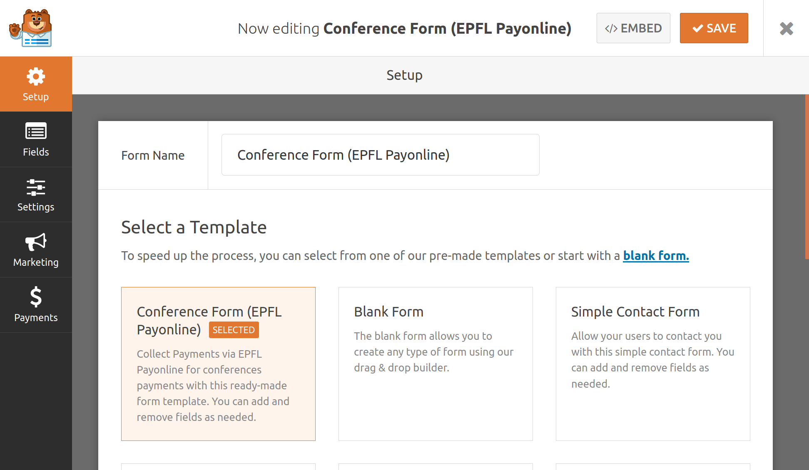
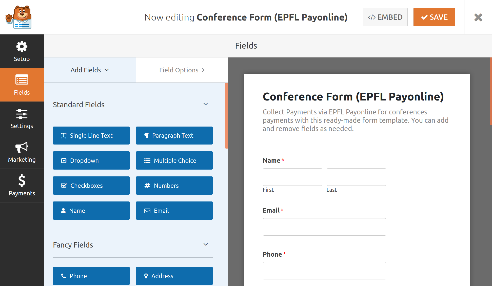
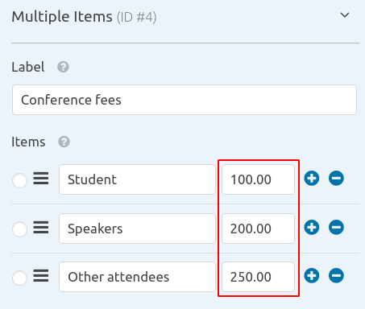
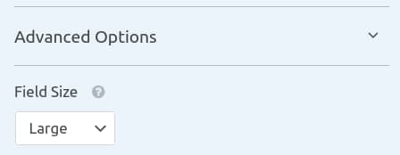
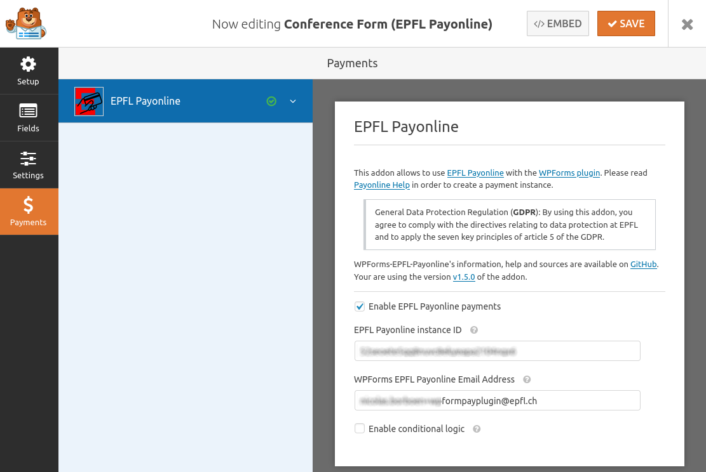
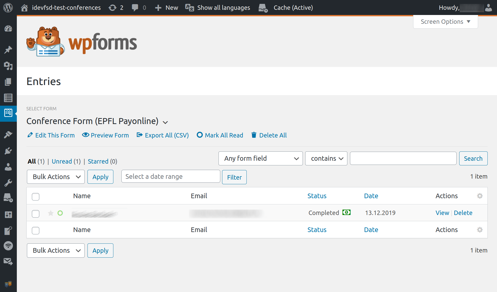
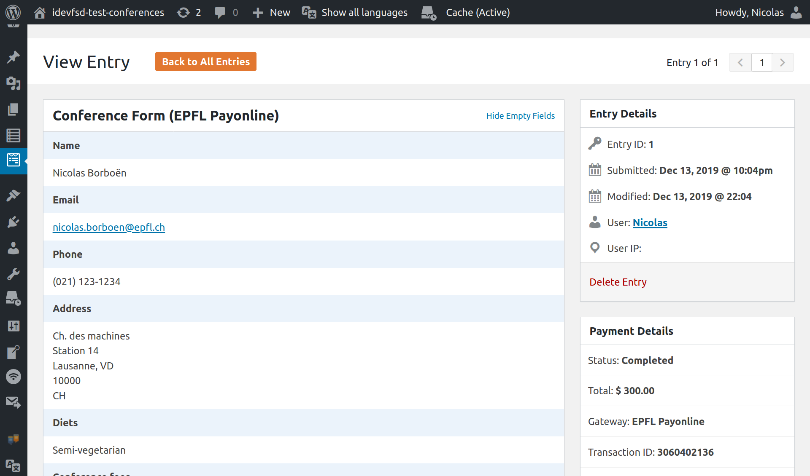
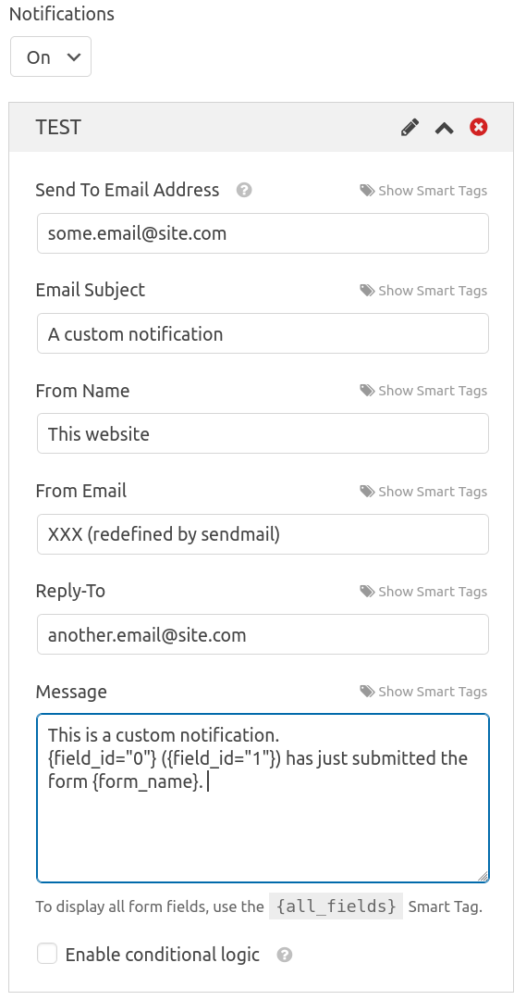

# HowTo

Ce document décrit l'utilisation de WPForms avec son add-on payonline pour
l'EPFL.

ⓘ Il y est présumé que vous avez accès à payonline (pour les demandes d'instances)
et à l'interface d'administration d'un site WordPress.

<!-- TOC titleSize:2 tabSpaces:2 depthFrom:1 depthTo:6 withLinks:1 updateOnSave:1 orderedList:0 skip:1 title:0 charForUnorderedList:* -->
* [Pour commencer](#pour-commencer)
* [LPD / GDPR](#lpd--gdpr)
* [Création du formulaire](#création-du-formulaire)
* [Adaptation / Modification du formulaire](#adaptation--modification-du-formulaire)
  * [Entrées obligatoires](#entrées-obligatoires)
  * [Entrées avec prix](#entrées-avec-prix)
  * [CSS et mise en page](#css-et-mise-en-page)
  * [Logique conditionnelle](#logique-conditionnelle)
* [Paramétrage du formulaire](#paramétrage-du-formulaire)
* [Configuration des paiements](#configuration-des-paiements)
* [Affichage du formulaire](#affichage-du-formulaire)
* [Test du formulaire](#test-du-formulaire)
  * [Simuler des paiements](#simuler-des-paiements)
* [Voir les entrées du formulaire](#voir-les-entrées-du-formulaire)
  * [Export au format CSV](#export-au-format-csv)
  * [Détail d'une entrée](#détail-dune-entrée)
* [Ajout de notifications](#ajout-de-notifications)
* [Notes sur payonline](#notes-sur-payonline)
  * [Source de vérité](#source-de-vérité)
  * [Devises](#devises)
  * [Détails de programmation](#détails-de-programmation)
  * [URL de retour](#url-de-retour)
* [Activation du formulaire](#activation-du-formulaire)
* [Aide et support](#aide-et-support)
<!-- /TOC -->

## Pour commencer

L'installation nécessite une opération de la part de l'équipe WordPress de
l'EPFL. Cette opération permet la mise en place du plugin WPForms et de son
add-on payonline. Merci de contacter le [1234] afin de demande l'activation des
formulaires et des paiements pour un site donné.

Le demandeur doit également avoir accès à https://payonline.epfl.ch afin
de pouvoir configurer l'instance de paiement. Il est recommandé d'avoir une
nouvelle instance de paiement, ce qui permet de faire des tests de paiements
avec le formulaire avant de demander la validation de l'instance par le service
financier. Les étapes pour la mise en place sont décrites dans
l'[aide de payonline].

## LPD / GDPR

La mise en place d'un formulaire permet potentiellement de recueillir des
informations personnelles pour lequelles vous vous engagez à traiter selon le
réglement de l'EPFL.

Voici un extrait de la [politique de l’EPFL relative à la protection des données
personnelles] :

> L’EPFL est tenue de respecter les principes relatifs à la protection des
données. En application de ces principes, nous ne traiterons que des données :
> 1. de manière licite, loyale et transparente ;
> 1. pour des finalités déterminées, explicites et légitimes puis toujours d’une
manière compatible avec ces finalités ultérieurement ; un traitement ultérieur à
des fins d’archivage dans l’intérêt public, à des fins de recherche scientifique
ou historique ou à des fins statistiques n’étant par ailleurs pas considéré
comme incompatible avec les finalités initiales ;
> 1. adéquates, pertinentes et limitées à ce qui est nécessaire au regard des
finalités pour lesquelles elles sont traitées ;
> 1. exactes ;
> 1. conservées sous une forme permettant l’identification des personnes
concernées pendant une durée n’excédant pas celle nécessaire à la réalisation
des finalités pour lesquelles elles sont traitées ; les données à caractère
personnel peuvent être conservées pendant une durée plus longue dans la mesure
où elles seront traitées uniquement à des fins d’archivage dans l’intérêt
public, à des fins de recherche scientifique ou historique ou à des fins
statistiques, sous réserve de la mise en œuvre des mesures techniques et
organisationnelles appropriées ;
> 1. traitées de manière à assurer une sécurité appropriée des données à
caractère personnel.

De manière spécifique à l'organisation de conférence, il est demandé aux
organisateurs de rendre disponible sur le site de la conférence la [politique de
confidentialité pour les événements] selon le chablon disponbile.

## Création du formulaire

Depuis l'écran d'administration WordPress, naviguez dans le menu «WPForms» et
cliquez «Add new». Dans le nouvel écran, utilisez un modèle à disposition, par
exemple «Conference Form (EPFL Payonline)» :  

Assurez-vous de modifier le titre (dans le champ «Form Name») de votre
formulaire.

Ce modèle est un exemple de formulaire pour une conférence que vous
pouvez facilement adapter à vos besoins.

⚠ Dans le cas ou vous créez un formulaire «from scratch», assurez vous de lire
le §Détails de programmation.

## Adaptation / Modification du formulaire

Dans le menu de gauche, naviguez sur l'entrée «Fields» :  

C'est dans cette interface que vous pouvez adapter et modifier le formulaire.
L'interface permet les «drag and drop» pour ajouter de nouveaux champs ou pour
réorganiser leurs emplacements.
Il est possible de modifier les champs en cliquant dessus.

### Entrées obligatoires

Dans le menu «Fields Options», cochez la case «Required» :  

### Entrées avec prix

Certains champs (par exemple les listes déroulantes ou les entrées ayant un
prix) ont des options spécifiques. L'encadré rouge ci-dessous montre où définir
les montants des entrées, toujours depuis le menu «Fields Options» :  

### CSS et mise en page

Dans le menu «Advanced Options» d'un champ, il est possible de définir quelques
options concernant la mise en page du formulaire. Il est recommandé d'utiliser
les entrées «Style / Modern» et le «Field Size / Large» :  

### Logique conditionnelle

Il est possible d'activer la logique conditionnelle pour des champs. Cela
permet d'afficher des champs en fonction des réponses d'autres, et permet, par
exemple, d'ajouter des choix ou des coûts supplémentaires en lien avec d'autres
champs.

## Paramétrage du formulaire

Le menu («Settings») permet de modifier la configuration du formulaire. Il y
est possible de modifier le titre du formulaire, sa description, de modifier
les notifications par défaut ou encore de changer le mail du destinataire des
notifications. À notre que les valeurs par défaut sont gérées par le plugin et
opèrent de la manières attendues.

ⓘ Par défaut, WPForms utilise le mail de l'admninistrateur de l'instance
WordPress. Dans notre configuration, les utilisateurs ne peuvent pas le changer,
mais cet email est redéfini lors si l'utilisateur spécifie un autre email dans
la configuration des paiements (voir ci-dessous).

## Configuration des paiements

Le menu («Payments») permet d'activer les paiements et de faire le lien
avec payonline. Pour assurer le bon fonctionnement de l'add-on lors de son
activation, vous devez spécifier une instance payonline et un email valide :  

ⓘ Il est aussi nécessaire que l'instance soit configurée de manière correcte du
côté de payonline ; référez-vous au §Notes sur payonline de ce document.

## Affichage du formulaire

Afin que vos utilisateurs puissent utiliser le formulaire, vous devez le
placer dans une page du site à l'aide d'un «shortcode», par exemple
`[wpforms id="1" title="false" description="false"]`.

Il est nécessaire que l'identfiant (`id`) dans le shortcode corresponde à celui
de votre formulaire. Vous pouvez facilement trouver le shortcode en cliquant
sur le bouton «</> EMBED» depuis l'édition d'un formulaire, ou depuis la liste
de tous vos formulaires (menu WPForms / All Forms).

## Test du formulaire

En accédant à la page sur laquelle le formulaire est présent, vous pouvez
maintenant tester le formulaire. 💡 Notez qu'il est possible de tester le
formulaire depuis le mode preview de WordPress, ou depuis une page privée ou
protégée par password afin qu'elle ne soit pas accessible aux utilisateurs.

### Simuler des paiements

Pour autant que l'instance payonline soit en mode test, vous pouvez alors
simuler des paiements : le plus simple est de tester avec la carte PostFinance
(il suffit de cliquer sur le bouton «paiement accepté»), mais les autres moyens
de paiements sont aussi disponibles et leurs utilisations est décrite dans
l'[aide de payonline](https://wiki.epfl.ch/payonline-aide/howto#step4).

## Voir les entrées du formulaire

En naviguant sur un formulaire depuis le menu WPForms, on peut accéder aux 
différents formulaires soumis par les utilisateurs :  

Cela permet d'avoir une vue d'ensmble des réponses à un formulaire avec le
status des paiements. Depuis cette page il est possible d'exporter les réponses
en CSV.

### Export au format CSV

L'exportation du fichier CSV des réponses d'un formulaire fonctionne sans
problème avec [OpenOffice], [LibreOffice] ou [GoogleSpreadSheet]. Néanmoins,
si vous utilisez Microsoft Excel, il se peut que le résultat ne soit pas celui
attendu. En effet, ce logiciel gère mal le [codage des caractères en UTF-8]
ou les [retours] de [lignes]. Si votre problème concerne que le codage des
caractères, regardez cette vidéo : https://youtu.be/Q19zNJwQFz4. Sinon, il est
recommandé d'utiliser un autre logiciel.

### Détail d'une entrée

Le détails d'une entrée du formulaire permet de retrouver tous les champs saisis
par l'utilisateur. Additionnellement, il est possible d'y ajouter des notes
de travail. Aussi, une boîte «Payment Details» permet d'accéder rapidement au
détails du paiement sur payonline.epfl.ch. Ce sont les informations de payonline
qui font fois.

## Ajout de notifications

Comme mentionné dans le §Paramétrage du formulaire, il est possible de
configurer les notifications que WPForms envoie. Lorsque l'add-on payonline est
activé, il redéfini la variable `{admin_email}` avec l'email mentionné dans la 
configuration de paiements. Néanmoins, il est tout à fait possible de modifier 
ou de créer de nouvelles notifications avec d'autres email, voici un exemple :  

## Notes sur payonline

### Source de vérité

Bien que l'information sur le status des paiements soit remontée dans WordPress,
Payonline est la référence en cas de doute.

### Devises

Comme mentionné dans l'[aide de payonline], les paiements sont possibles en
francs suisses (CHF), euros (EUR) et dollars US (USD).

ⓘ En règle générale, pour les activités organisées on Suisse, il est recommandé
d'utiliser les francs suisses (CHF).

### Détails de programmation

Comme mentionné dans les [détails de programmation] dans l'[aide de payonline],
le système contient des **champs imposés** :

| Paramètre     | Type        | Description                                          |
| ------------- | ----------- | ---------------------------------------------------- |
| `id_inst`     | obligatoire | Défini lors de la création de l’instance de paiement |
| `Currency`    | obligatoire | Code de la monnaie; valeur possible: CHF             |
| `Total`       | obligatoire | Montant de la transaction; exemple: 100.00           |
| `LastName`    | obligatoire | Nom du client                                        |
| `FirstName`   | obligatoire | Prénom du client                                     |
| `Addr`        | obligatoire | Adresse du client                                    |
| `ZipCode`     | obligatoire | Code postal                                          |
| `City`        | obligatoire | Ville                                                |
| `Country`     | obligatoire | Code ISO du pays; exemple: CH                        |
| `lang`        | optionnel   | Langue de l’interface (`fr`, `en`; défaut: `en`)     |
| `id_transact` | optionnel   | Identificateur de la transaction côté application    |
| `Email`       | optionnel   | Adresse mail du client                               |
| `Phone`       | optionnel   | Téléphone                                            |
| `Fax`         | optionnel   | Fax                                                  |

Les noms de ces paramètres sont **imposés**; tout autre paramètre sera
enregistré et rendu disponible pour une extraction de type CSV en mode accès
administrateur ou retourné vers l’adresse de retour (si présente).

⚠ Cela signifie que les noms des champs pour un nouveau formulaire doivent
correspondre à ceux **imposés** par [Payonline] !

### URL de retour

Afin de remonter l'information sur le status d'un paiement de payonline à
WordPress, il est nécessaire que l'URL de retour de l'instance payonline soit
configurée de manière correcte.

ⓘ L'URL de retour est composée du l'URL de la page d'accueil de votre suite
suffixée de `?EPFLPayonline`.

Par exemple, l'URL de retour pour le site `https://www.epfl.ch/campus/` sera
`https://www.epfl.ch/campus/?EPFLPayonline`.

## Activation du formulaire

Les deux dernières étapes sont de demander l'activation de l'instance de
paiement via payonline.epfl.ch ([via le SF de l'EPFL]) et s'assurer que la page
contenant le formulaire est accessible par les principaux intéressés.

## Aide et support

[WPForms] est un plugin WordPress pour lequel la documentation est accessible
sur https://wpforms.com/docs/. [WPForms EPFL Payonline] est un add-on à WPForms
dont le code source est disponible sur [GitHub]. Les demandes d'ordre techniques
ou les demandes d'améliorations peuvent être adressées via des [issues] sur
le dépôt. Les autres demandes peuvent être adressées au service desk, via le
[1234].

[1234]: mailto:1234+wpforms@epfl.ch
[Aide de payonline]: https://wiki.epfl.ch/payonline-aide
[détails de programmation]: http://payonline.epfl.ch/docs/transactions.pdf
[via le SF de l'EPFL]: https://wiki.epfl.ch/payonline-aide/howto#step5
[Politique de l’EPFL relative à la protection des données personnelles]: https://go.epfl.ch/gdpr
[Politique de confidentialité pour les événements]: https://www.epfl.ch/campus/services/accueil/organiser-un-evenement/
[OpenOffice]: https://www.openoffice.org/
[LibreOffice]: https://www.libreoffice.org/
[GoogleSpreadSheet]: https://docs.google.com/spreadsheets
[WPForms]: https://wpforms.com/
[WPForms EPFL Payonline]: https://github.com/epfl-si/wpforms-epfl-payonline
[codage des caractères en UTF-8]: https://answers.microsoft.com/en-us/msoffice/forum/all/how-to-open-utf-8-csv-file-in-excel-without-mis/1eb15700-d235-441e-8b99-db10fafff3c2
[retours]: https://stackoverflow.com/questions/2668678/importing-csv-with-line-breaks-in-excel-2007
[lignes]: https://superuser.com/questions/319549/importing-multiline-cells-from-csv-file-into-excel
[GitHub]: https://github.com/epfl-si/wpforms-epfl-payonline
[issues]: https://github.com/epfl-si/wpforms-epfl-payonline/issues
